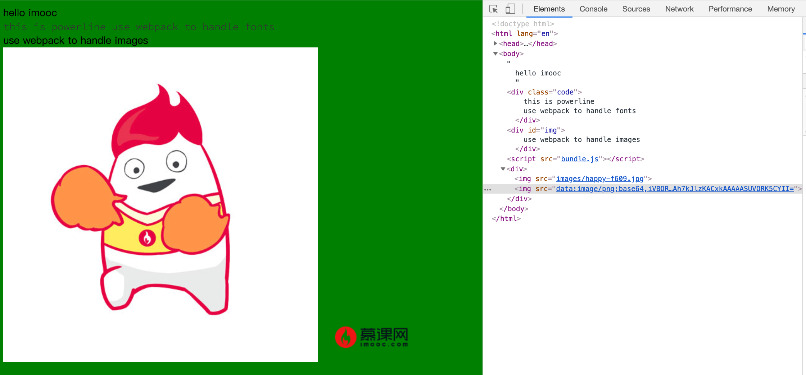

# 第三周 2-7 作业

## 任务描述

1. 使用 loaders-start.zip 中的文件作为初始项目。

2. 使用 npm install 安装依赖

3. 配置 webpack.config.js，使用 npm run build 构建项目

4. 最终实现如下图所示的效果
   

## 实际操作

1. 安装 url-loader, file-loader 来导入图片和字体资源,并安装了 html-webpack-plugin 使用 html 模版.

2. 在 index.js 中创建元素并添加图片, 在 index.scss 中添加字体.

3. 修改 webpack 配置文件, 添加 url-loader 和 plugins 的配置.

   - 图片的大小限制 `limit: 5120`
   - HtmlWebpackPlugin 的模版文件位置 `src/template.html`

4. webpack 打包后发现图片不显示, 图片链接变成了对象, 修改 index.js
   ```
   require("./index.scss");
   const logo = require("./logo.png");
   const happy = require("./happy.jpg");
   ```
   改为
   ```
   import "./index.scss";
   import logo from "./logo.png";
   import happy from "./happy.jpg";
   ```
   显示正常.
   或者在 webpack 配置文件中 url-loader 图片配置选项中加上`esModule: false`
