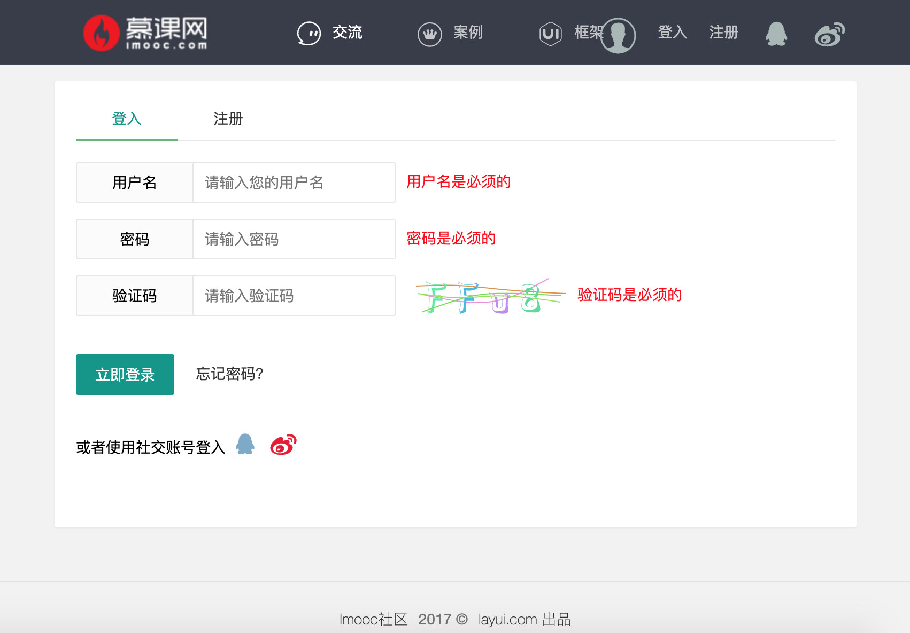
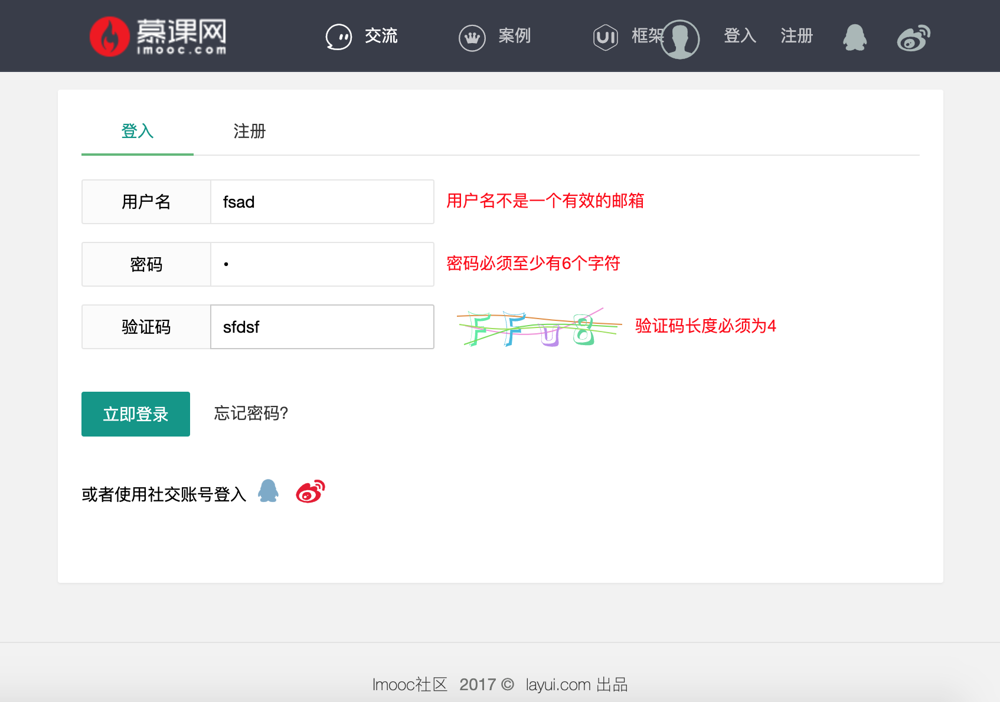
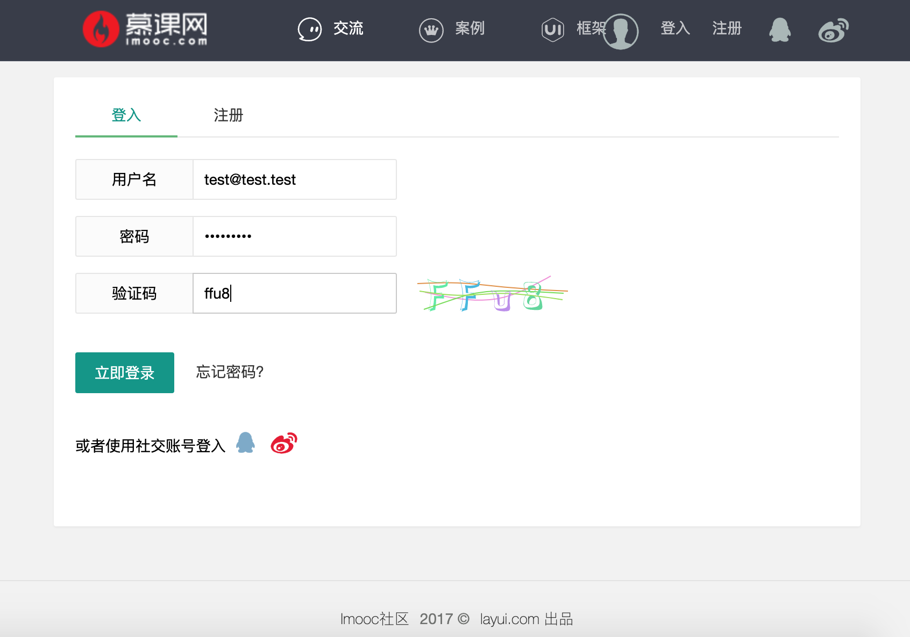
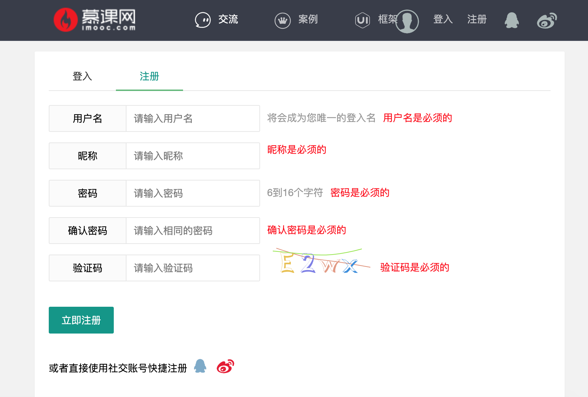
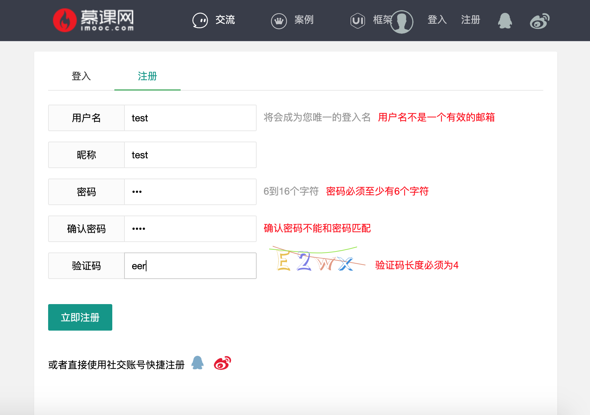
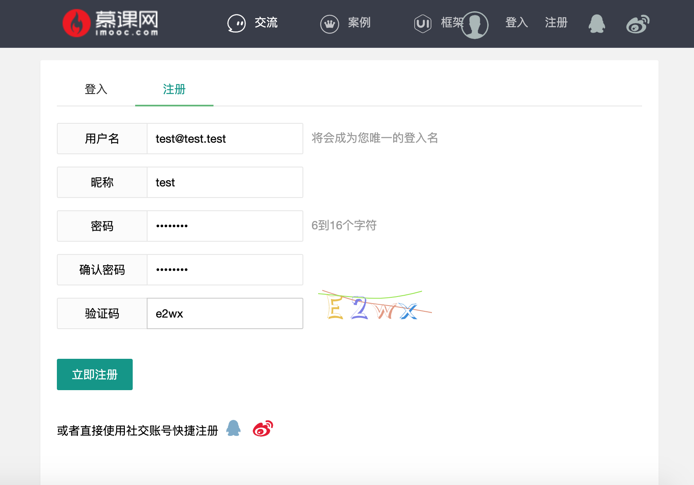
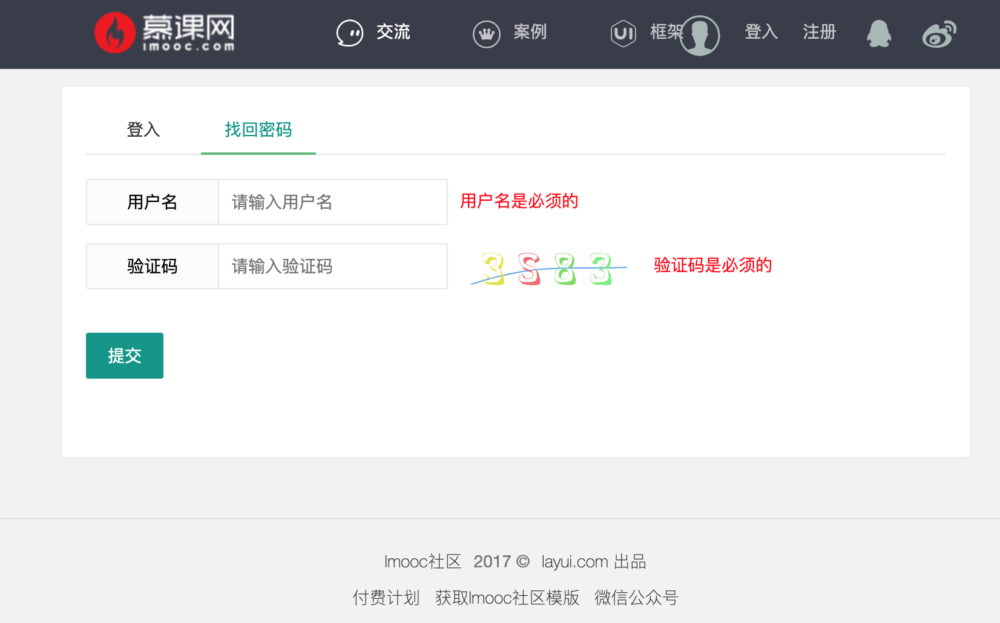
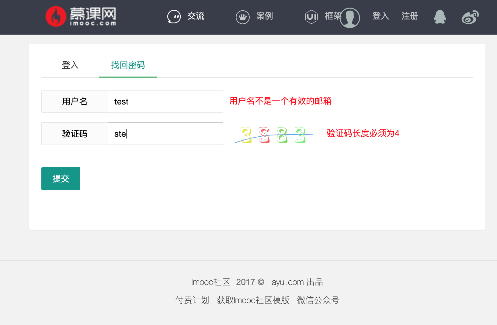
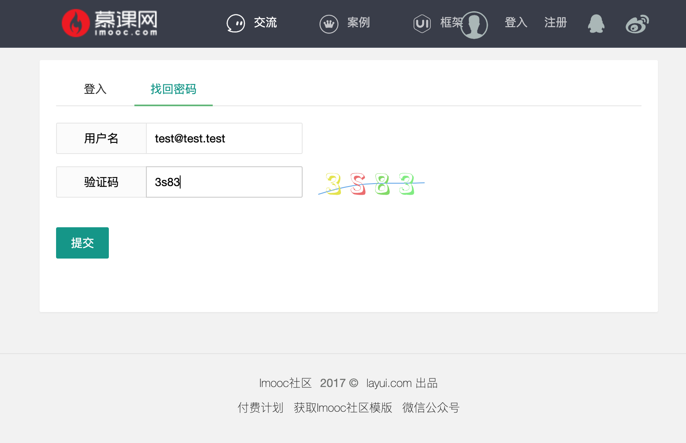

# 第五周 3-15 作业

## 任务描述

1. 完成登录、注册、忘记密码组件

2. 用户输入验证（邮箱格式、长度、最小长度、相等）

3. 图片验证码

## 要求

1. 复用开发的Api中的图片验证码的接口；

2. 注册表单中使用Veevalidate的密码验证功能；

## 实现效果

使用veevalidate3 完成了校验功能

### 登录页面

### 注册页面

### 忘记密码页面

